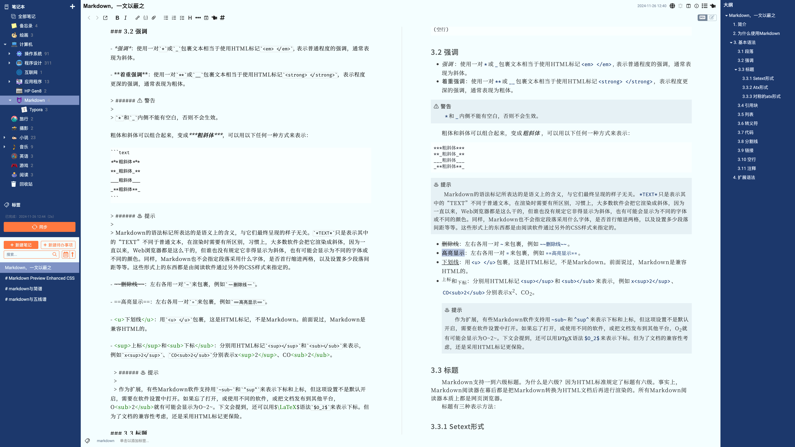
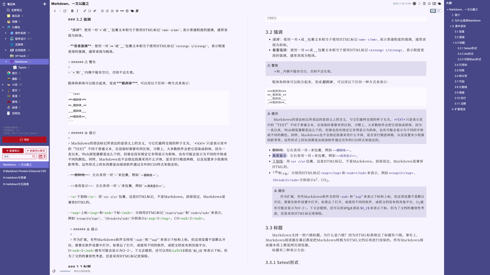
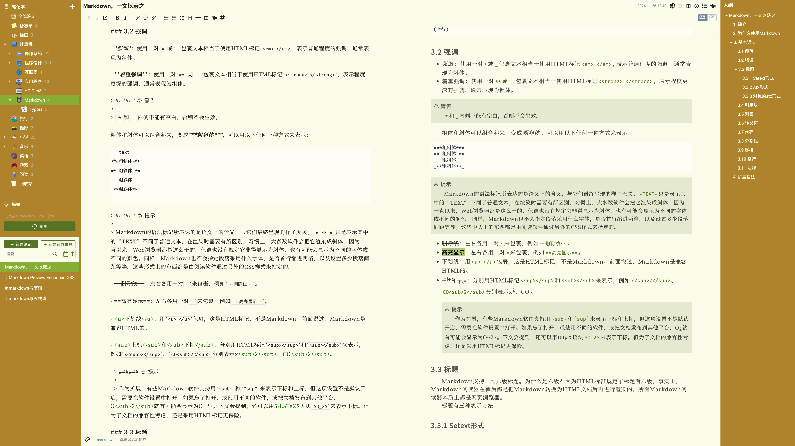
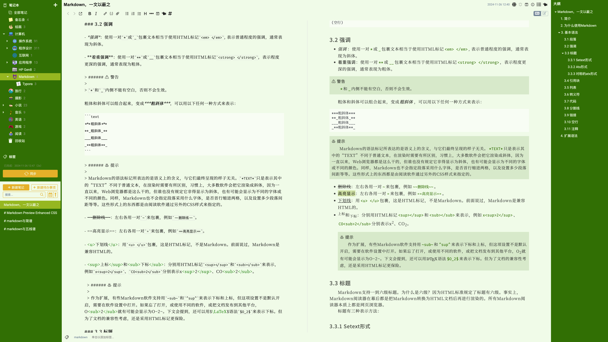
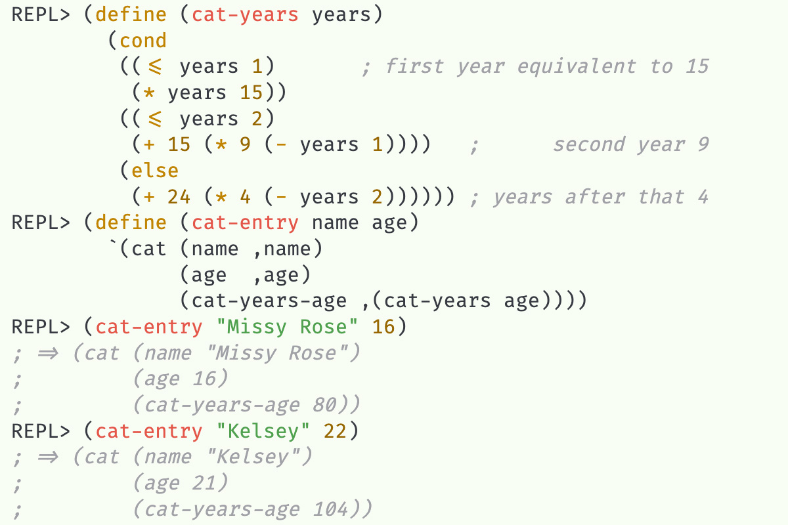
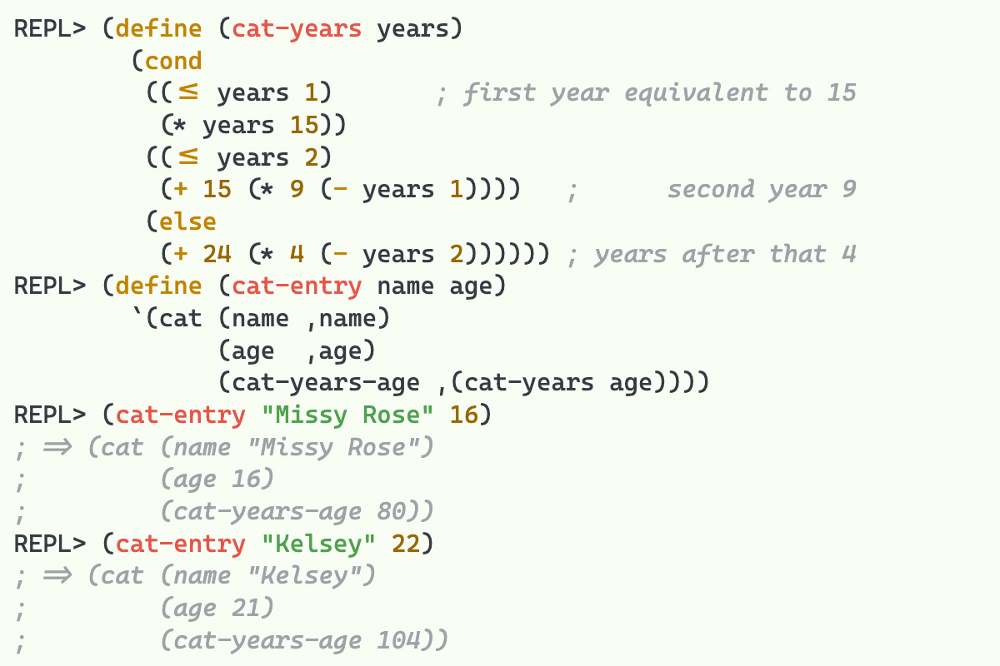

## 简介

本项目是为Joplin笔记软件制作的一个主题系列。由于Joplin本身的限制，目前仅支持Joplin Desktop版本，而且仅在macOS上做了测试。理论上，它也应该适用于Windows和Linux系统上的Joplin笔记软件。

本项目的特点包括：

- 适合普通文字编辑和阅读的明亮主题

- 以水果为主题进行配色，色彩鲜艳活泼，提供愉悦的视觉享受

- 整体画面和谐统一，反差较小，柔和不刺眼，有护眼效果

- 对各种文本排版元素作了精细调整，排版美观协调

- 基本不受软件内部主题设置影响

- 采用开源字体

- 正文采用宋体字，首行缩进两个汉字，没有额外的段落间距

- 代码字体支持连字

- 自动显示和隐藏滚动条

- 支持Outline和Abc Sheet Music插件

## 主题展示

- **blueberry** 
- **grape** 
- **kiwi** 
- **lime** 
- **orange** 

## 如何安装

> ###### ♨ 提示
>
> 安装前请确保你所安装的是最新的Joplin Desktop版本。

1. 选择source目录中与主题名字相同的目录，下载其中3个CSS文件：

  - userchrome.css
  - userstyle.css
  - outline.css

2. 在Joplin“帮助”菜单中，选择“打开配置文件目录”。

3. 将下载的3个CSS文件复制到Joplin配置目录中

4. 重启Joplin

## 关于字体

本主题默认使用开源的思源VF字体，但这些字体并没有包含在本项目内，需要你自行下载安装。不安装额外的字体也不会影响主题使用，但为了更好的显示效果，请下载并安装以下字体：

- Source Han Sans VF：[Variable OTF/TTF/OTC/WOFF2](https://github.com/adobe-fonts/source-han-sans/releases/download/2.004R/SourceHanSans-VF.zip)
- Source Han Serif VF：[All Variable Fonts (OTF, TTF, OTC, WOFF2)](https://github.com/adobe-fonts/source-han-serif/releases/download/2.003R/02_SourceHanSerif-VF.zip)

代码字体采用支持连字的开源字体，请选择安装以下两者之一：

- [Fira Code](https://github.com/tonsky/FiraCode/releases/download/6.2/Fira_Code_v6.2.zip)
- [Cascadia Code](https://github.com/microsoft/cascadia-code/releases/download/v2404.23/CascadiaCode-2404.23.zip)

两个都安装的话，默认会使用Fira Code。

两种字体的显示效果对比如下：

| Fira Code            | Cascadia Code            |
| :------------------: | :----------------------: |
|  |  |
